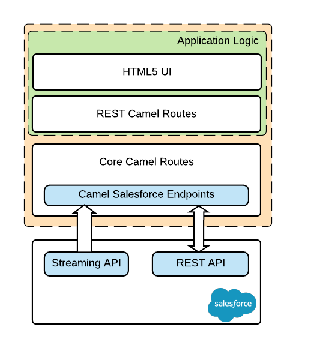
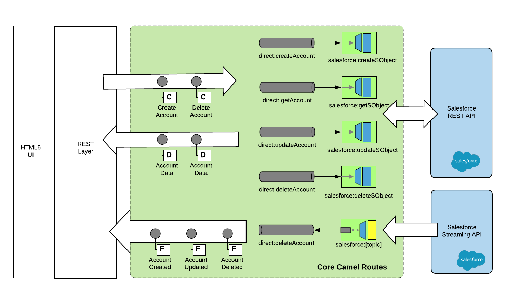

# What is this?

This is a sample application that demonstrates how to integrate Red Hat Fuse and Salesforce.

# Design and implementation

The application consists of:

* Camel routes connecting to Salesforce endpoints for performing CRUD operations, as well as receiving Salesforce notifications - this forms the core of the integration;
* Camel routes implementing a RESTful API that connect with the Salesforce routes;
* A HTML5 single-page application that interacts with the RESTful API and triggers the Camel routes
* http://hawt.io[Hawtio] console for monitoring and visualizing Camel routes

A high level view of the integration can be seen below.

A detailed overview of the core Camel routes for integrating with Salesforce is available below.

# How can I run it?

You can run this application from the root directory of the project. 

    ./mvnw spring-boot:run
    
You can access the application in the browser at https://localhost:8080.

You can access the hawtio console at https://localhost:8080/hawtio.

